# DevPulse — Аналитика эффективности разработки

## Что это и зачем

DevPulse решает ключевую проблему руководителей разработки: **отсутствие объективной и регулярной картины эффективности команды**. Вместо субъективных оценок и ручного сбора данных из таск-трекера, система автоматически собирает метрики из YouTrack, рассчитывает показатели и генерирует AI-анализ с рекомендациями.

**Результат**: руководитель получает еженедельный срез по каждому сотруднику, проекту и команде — без ручной работы, с трендами и подсказками от AI.

---

## Дашборд — общая картина за 10 секунд

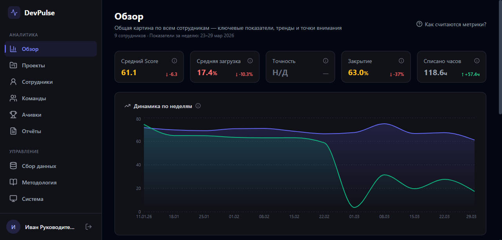

Открываем DevPulse — и сразу видим состояние всей разработки. Пять ключевых метрик с индикаторами динамики: Score упал на 6.3 — повод разобраться, загрузка снизилась — возможно, часть команды не задействована. Графики трендов показывают историю за выбранный период, а блок «Обратите внимание» автоматически подсвечивает аномалии, которые требуют внимания руководителя. В нижней части — лента последних достижений сотрудников, чтобы отмечать успехи, а не только проблемы.

---

## Проекты — моментальный срез по каждому направлению

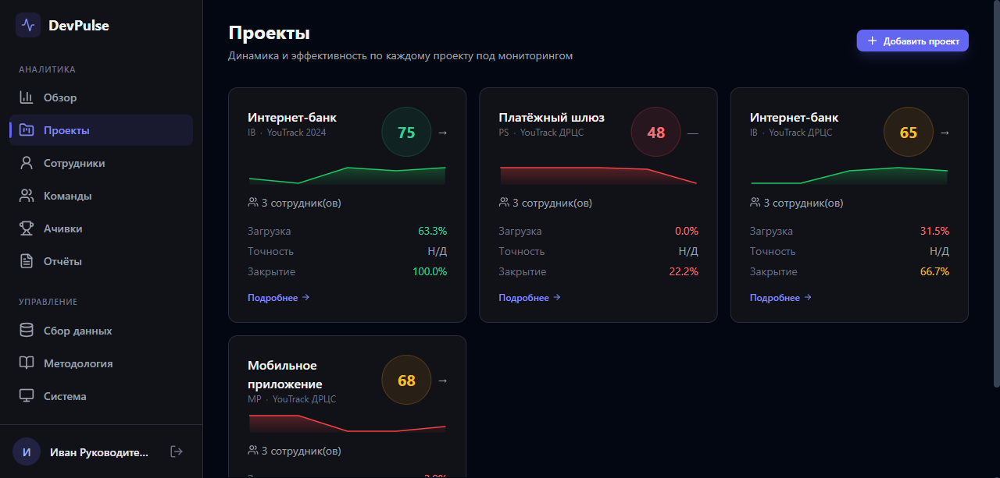

Каждый проект под мониторингом представлен карточкой с Score (цветовая шкала от красного к зелёному), мини-графиком динамики и ключевыми метриками: загрузка, точность оценок, процент закрытия задач. Сразу видно: «Интернет-банк» на YouTrack 2024 — Score 75, всё стабильно; «Платёжный шлюз» — Score 48, команда простаивает (загрузка 0%), закрытие только 22%. Это сигнал к действию — и он виден без единого клика внутрь.

---

## Проект в деталях — drill-down до конкретных цифр

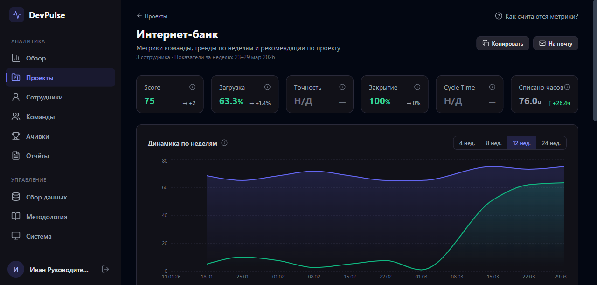

Провалившись в проект, получаем полный набор из шести KPI с дельтами неделя к неделе, график трендов с гибким выбором периода (4/8/12/24 недели), список точек внимания и AI-рекомендации. Внизу — таблица всех сотрудников проекта с их персональными метриками, сортируемая по любому показателю. Кнопки «Копировать» и «На почту» позволяют мгновенно поделиться данными — на совещание или в письме вышестоящему руководству.

---

## Сотрудники — полная таблица с фильтрацией

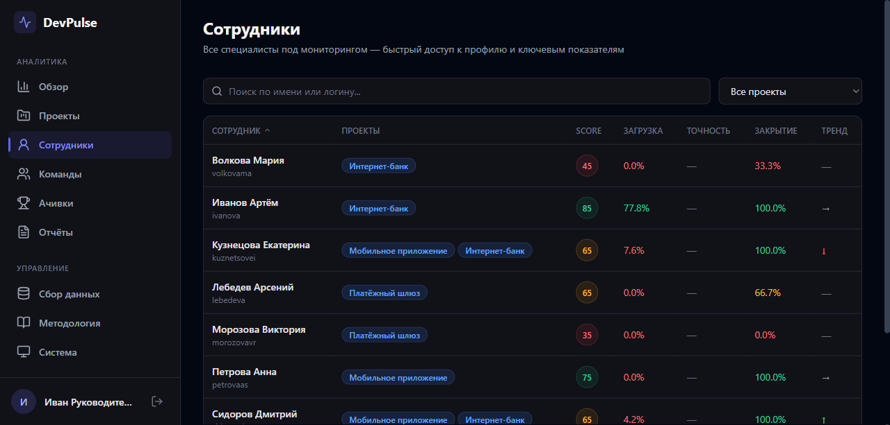

Единая таблица всех специалистов под мониторингом. Поиск по имени, фильтр по проекту, сортировка по любой метрике. Цветовая индикация мгновенно выделяет проблемные зоны: красный Score у Морозовой (35) — нужно разобраться, зелёный у Иванова (85) — отличный результат. Стрелки тренда показывают, кто растёт, а кто снижает показатели. Клик по строке — переход в детальный профиль.

---

## Профиль сотрудника — 360-градусный взгляд

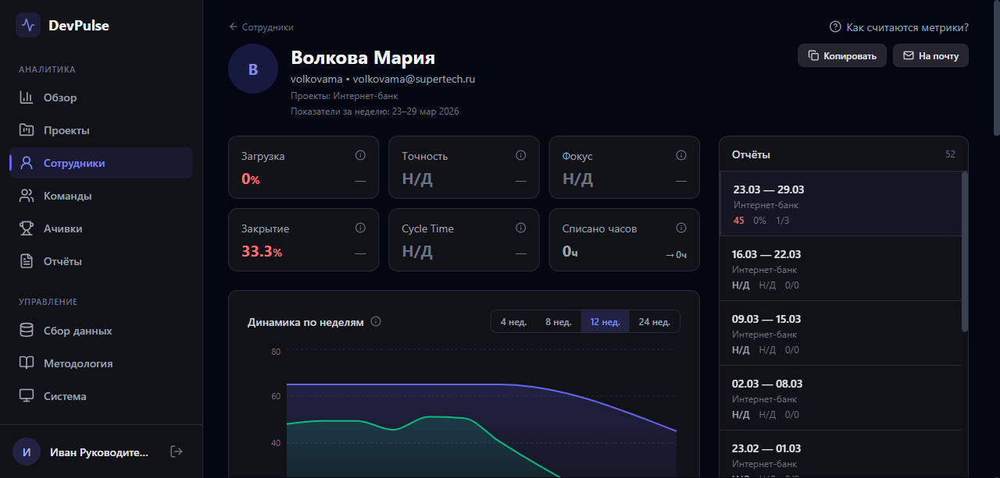

Самый насыщенный экран системы. В шапке — KPI: загрузка, точность оценок, фокус на продуктовые задачи, закрытие, время цикла. График трендов показывает историю: где был сотрудник 4 недели назад и куда движется. Диаграмма разбивки по типам задач — понимаем, на что уходит время. AI-блок формирует текстовое резюме, выделяет достижения, проблемы и даёт конкретные рекомендации. Справа — боковая панель с историей всех еженедельных отчётов: можно переключаться между периодами и видеть эволюцию.

---

## Команды — кросс-проектная аналитика

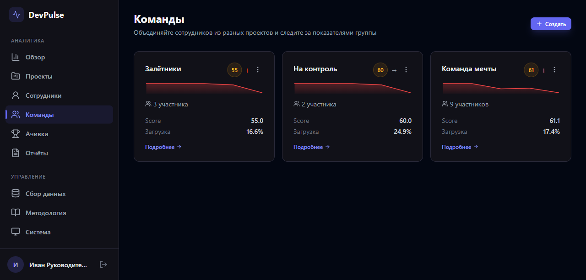

Не всегда интересно смотреть по проектам — иногда нужно оценить группу людей из разных направлений. Команды — это кастомные группы: «Залётники» (3 участника, Score 55), «На контроль» (2 человека, Score 60), «Команда мечты» (9 участников, Score 61). Создаются в один клик, состав редактируется. Удобно для отслеживания отделов, рабочих групп или просто списка сотрудников на контроле.

---

## Команда в деталях — агрегированные показатели группы

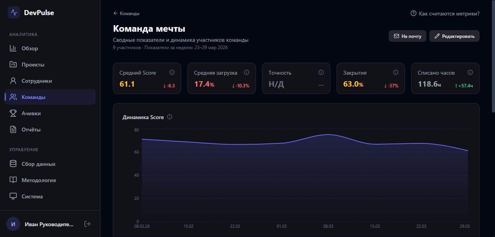

Внутри команды — те же 5 KPI, но агрегированные по всем участникам. График динамики Score за период, таблица каждого участника с персональными метриками. Кнопка «На почту» — отправить сводку по команде. «Редактировать» — изменить состав прямо на месте. Это инструмент для тимлида или руководителя направления, которому нужен срез по своим людям.

---

## Достижения — геймификация для мотивации

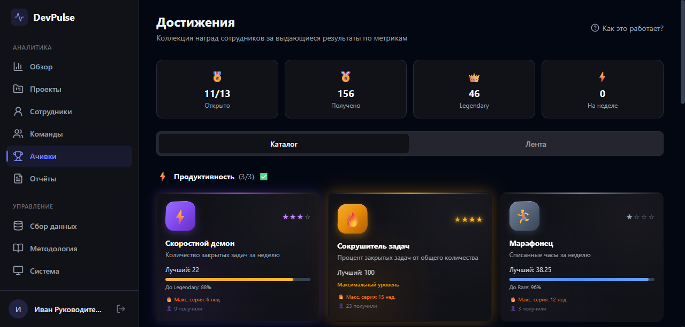

Система автоматически присваивает достижения на основе метрик: «Скоростной демон» за количество закрытых задач, «Сокрушитель задач» за процент закрытия, «Марафонец» за списанные часы. Пять уровней редкости от Common до Legendary, прогрессия по уровням. Каталог показывает все доступные типы, лента — кто что разблокировал. Это не просто декорация: достижения создают позитивную обратную связь и показывают сотрудникам, что их работа замечена.

---

## Отчёты — аналитика за произвольный период

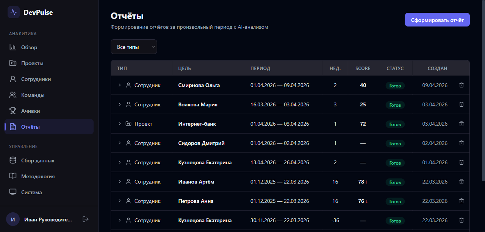

Еженедельные метрики — это текущий пульс. Но иногда нужно посмотреть шире: как сотрудник отработал за квартал? Как проект развивался за полгода? Раздел «Отчёты» позволяет сформировать аналитику за любой период по сотруднику, проекту или команде. Отчёт проходит через двухфазный pipeline: сначала собираются данные из YouTrack, затем AI анализирует результаты. Прогресс виден в реальном времени, статус обновляется автоматически.

---

## Готовый отчёт — KPI + AI-резюме

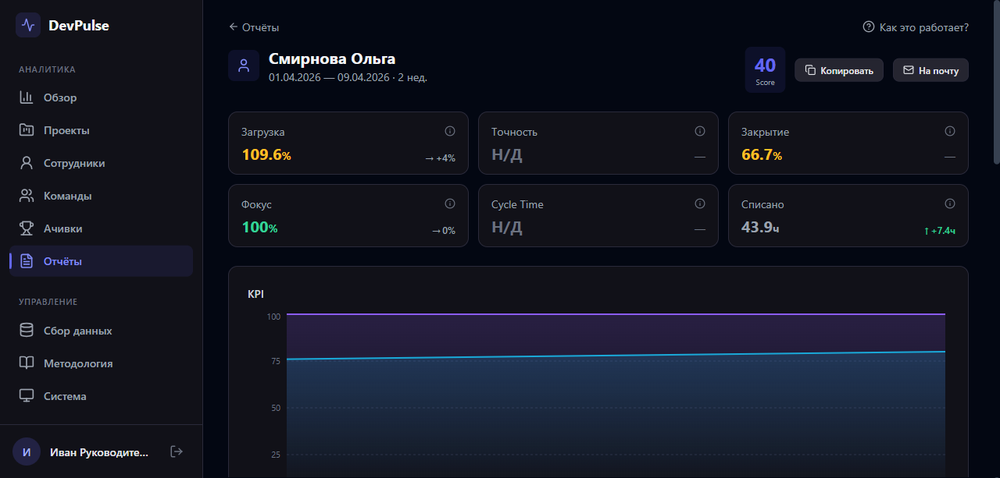

Готовый отчёт — это полноценный документ: 6 KPI за период с трендами, понедельный график прогрессии, развёрнутый AI-анализ с выводами и рекомендациями. Можно скопировать метрики в буфер обмена или отправить на почту — формат готов для пересылки руководству или обсуждения на 1-on-1. Боковая панель позволяет быстро переключаться между отчётами за разные периоды.

---

## Сбор данных — полный контроль над интеграцией

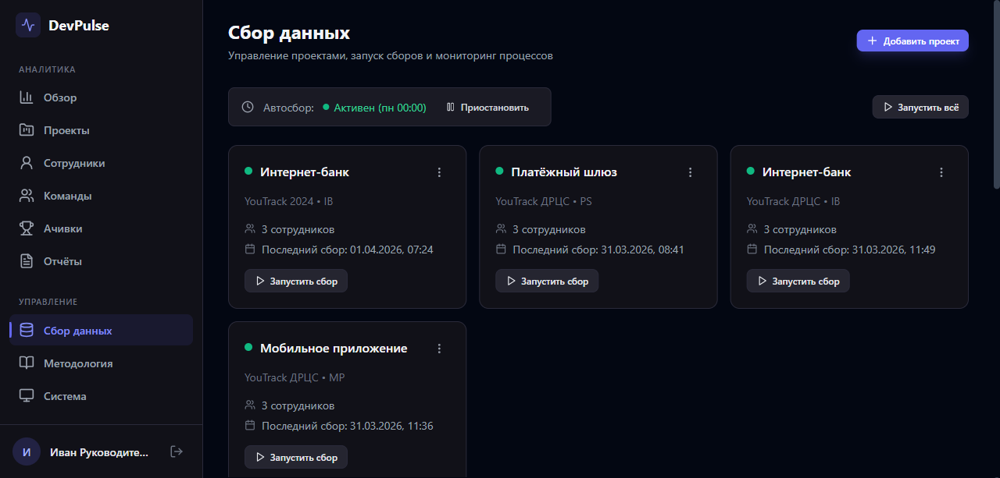

Здесь управляются подключения к YouTrack. Каждый проект — карточка с именем инстанса, количеством сотрудников и датой последнего сбора. Автосбор работает по cron-расписанию (на скриншоте — каждый понедельник в 00:00), но можно запустить вручную для одного проекта или всех сразу. Ниже — логи: что собрано, когда, сколько данных получено, были ли ошибки. Добавление нового проекта — пошаговый мастер.

---

## Методология — прозрачность метрик

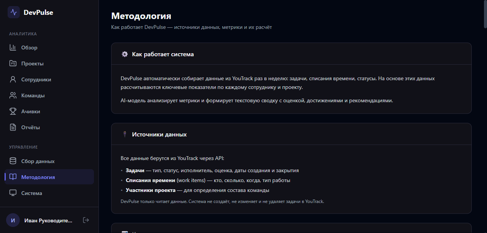

DevPulse не чёрный ящик. Раздел «Методология» подробно объясняет: откуда берутся данные (YouTrack API, read-only), как считается каждая метрика (формулы, пороги, цветовые зоны), как работает AI-анализ и что влияет на Score. Система только читает данные — не создаёт, не изменяет и не удаляет задачи в YouTrack. Это важно для доверия команды к инструменту.

---

## Настройки — интеграции и персонализация

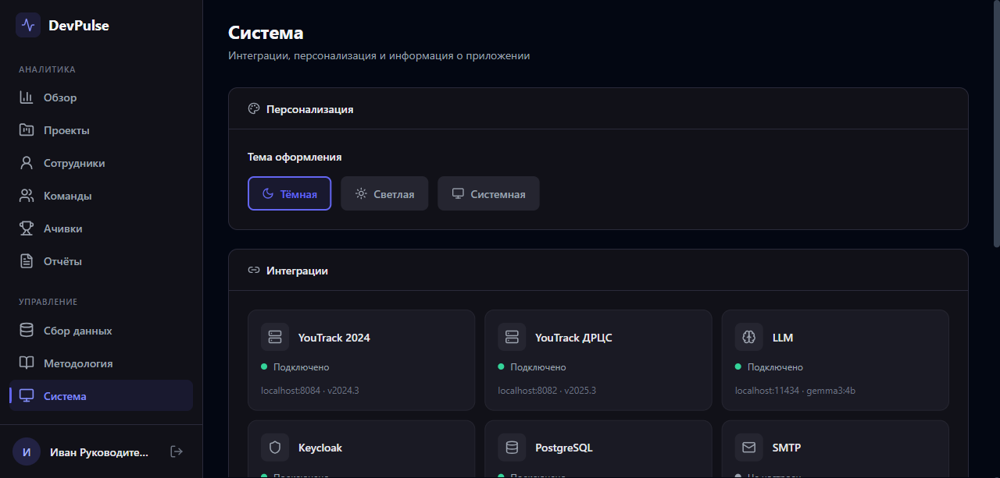

Переключение темы (тёмная/светлая/системная), статус всех интеграций в реальном времени: YouTrack-инстансы, LLM-провайдер, Keycloak, PostgreSQL, SMTP. Зелёный индикатор — подключено, красный — проблема. Здесь же — версия системы и информация о сборке.

---

## Итого: что даёт DevPulse

| Возможность | Ценность для руководителя |
|---|---|
| **Автоматический сбор** | Данные из YouTrack еженедельно, без ручной работы |
| **6 ключевых метрик** | Score, загрузка, точность, закрытие, время цикла, фокус |
| **AI-анализ** | Текстовые выводы, проблемы и рекомендации от LLM |
| **Тренды и динамика** | Видно не только текущее состояние, но и направление |
| **Автоматические алерты** | Система сама подсвечивает аномалии и проблемы |
| **Отчёты за любой период** | Квартальные ревью, годовые итоги — в пару кликов |
| **Кросс-проектные команды** | Группировка сотрудников из разных проектов |
| **Геймификация** | Достижения создают позитивную обратную связь |
| **Email-рассылка** | Отчёты на почту руководству одной кнопкой |
| **Keycloak SSO** | Три роли: director, manager, viewer — разграничение доступа |
| **Прозрачность** | Методология и формулы открыты, данные read-only |
